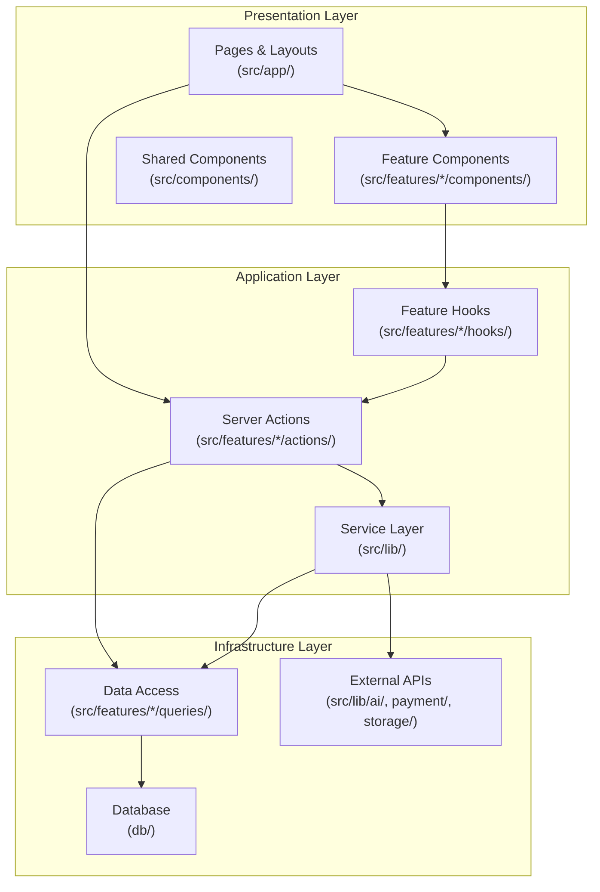
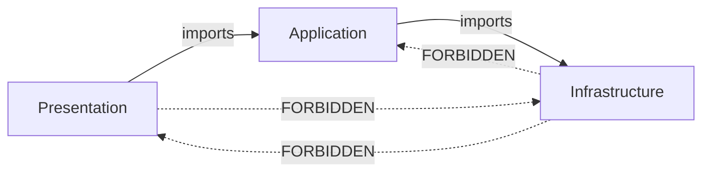
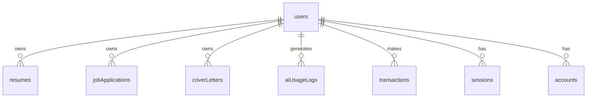

# Design Document: Enterprise Architecture Refactor

## Overview

This design document defines the technical architecture, patterns, and implementation strategy for refactoring the SiLamar application into an enterprise-grade codebase. The refactoring transforms the existing partial feature-based structure into a fully modular, type-safe, and performant architecture aligned with Clean Architecture principles and Next.js 16 best practices.

The refactoring is non-destructive to user-facing functionality — it reorganizes, standardizes, and optimizes the existing codebase without changing business behavior.

### Key Design Decisions

1. **Feature modules as bounded contexts** — each feature is a self-contained unit with its own components, hooks, actions, queries, types, and utils
2. **Three-layer architecture** — Presentation → Application → Infrastructure with strict unidirectional dependencies
3. **Zod as the single validation library** — used at all system boundaries (API inputs, env vars, external responses)
4. **Standardized action response type** — all server actions return `ActionResult<T>` discriminated union
5. **Centralized session retrieval** — single `getSessionUser()` in `src/lib/auth/` imported everywhere
6. **Environment validation at startup** — Zod schema in `src/config/env.ts` validates all env vars before app boots

## Architecture

### High-Level Architecture Diagram



### Directory Structure

```
src/
├── app/                          # Next.js App Router (Presentation entry points)
│   ├── (auth)/                   # Auth route group
│   │   ├── layout.tsx
│   │   ├── loading.tsx
│   │   ├── error.tsx
│   │   └── not-found.tsx
│   ├── (dashboard)/              # Dashboard route group
│   │   ├── layout.tsx
│   │   ├── loading.tsx
│   │   ├── error.tsx
│   │   └── not-found.tsx
│   └── api/                      # Route Handlers (streaming, webhooks, uploads only)
│       ├── auth/[...all]/
│       ├── ai/generate/
│       ├── payment/webhook/
│       └── upload/
├── features/                     # Feature Modules (bounded contexts)
│   ├── resume-builder/
│   │   ├── components/
│   │   ├── hooks/
│   │   ├── actions/
│   │   ├── queries/
│   │   ├── types/
│   │   ├── utils/
│   │   ├── schemas.ts
│   │   └── index.ts              # Barrel export (public API)
│   ├── cover-letter-builder/
│   ├── job-tracker/
│   ├── resumes-list/
│   ├── cover-letters-list/
│   ├── resume-analysis/
│   ├── billing/
│   └── auth/
├── components/                   # Shared UI components
│   ├── ui/                       # shadcn/ui primitives
│   ├── shared/                   # Reusable composed components
│   ├── layout/                   # Layout components
│   └── data-table/               # Generic data table
├── hooks/                        # Shared hooks
├── lib/                          # Service layer & utilities
│   ├── auth/                     # Auth service (getSessionUser, auth config)
│   ├── ai/                       # AI service client (injectable)
│   ├── payment/                  # Payment service client (injectable)
│   ├── storage/                  # File storage service (injectable)
│   ├── email/                    # Email service (injectable)
│   ├── http/                     # HTTP client with retry logic
│   └── utils/                    # Pure utility functions
├── config/                       # Application configuration
│   ├── env.ts                    # Environment variable validation (sole access point)
│   ├── site.ts                   # Site-wide constants
│   ├── sidebar.ts                # Navigation config
│   └── data-table.ts             # Data table config
└── types/                        # Cross-cutting shared types
    ├── action-result.ts          # Standard action response type
    ├── async-state.ts            # Discriminated union for async state
    └── auth.ts                   # Auth-related types
```

### Dependency Flow Rules



**Enforced by ESLint `import/no-restricted-paths`:**
- `src/features/X/` cannot import from `src/features/Y/`
- `src/features/` cannot import from `src/app/`
- `src/components/`, `src/hooks/`, `src/lib/`, `src/types/` cannot import from `src/features/` or `src/app/`
- Component files cannot import from `db/` or `drizzle-orm`

## Components and Interfaces

### Standard Action Result Type

```typescript
// src/types/action-result.ts
export type ActionResult<T> =
  | { success: true; data: T }
  | { success: false; error: string };
```

### Async State Discriminated Union

```typescript
// src/types/async-state.ts
export type AsyncState<T, E = string> =
  | { status: "idle" }
  | { status: "loading" }
  | { status: "error"; error: E }
  | { status: "success"; data: T };
```

### Session User Retrieval (Centralized)

```typescript
// src/lib/auth/session.ts
import "server-only";
import { cache } from "react";
import { auth } from "./index";
import { headers } from "next/headers";

export type SessionUser = {
  id: string;
  email: string;
  name: string;
  credits: number;
  plan: string;
  planExpiresAt: Date | null;
};

export const getSessionUser = cache(async (): Promise<SessionUser | null> => {
  const session = await auth.api.getSession({
    headers: await headers(),
  });

  if (!session?.user) return null;

  return {
    id: session.user.id,
    email: session.user.email,
    name: session.user.name,
    credits: session.user.credits,
    plan: session.user.plan,
    planExpiresAt: session.user.planExpiresAt,
  };
});
```

### Server Action Pattern

```typescript
// src/features/resume-builder/actions/update-resume.ts
"use server";

import { z } from "zod";
import { revalidatePath } from "next/cache";
import { getSessionUser } from "@/lib/auth/session";
import type { ActionResult } from "@/types/action-result";
import { updateResumeQuery } from "../queries/update-resume";

const updateResumeSchema = z.object({
  title: z.string().min(1).max(200).optional(),
  content: z.record(z.unknown()).optional(),
  atsScore: z.number().nullable().optional(),
});

type UpdateResumeInput = z.infer<typeof updateResumeSchema>;

export async function updateResume(
  id: string,
  input: UpdateResumeInput,
): Promise<ActionResult<{ id: string }>> {
  // 1. Auth check
  const user = await getSessionUser();
  if (!user) return { success: false, error: "Unauthorized" };

  // 2. Validation
  const parsed = updateResumeSchema.safeParse(input);
  if (!parsed.success) {
    return { success: false, error: parsed.error.issues[0].message };
  }

  // 3. Business logic (delegate to service if complex)
  try {
    const result = await updateResumeQuery(id, user.id, parsed.data);
    if (!result) return { success: false, error: "Resume not found" };

    // 4. Cache invalidation
    revalidatePath("/documents/resumes");
    revalidatePath(`/resume-builder/${id}`);

    return { success: true, data: { id: result.id } };
  } catch {
    return { success: false, error: "Failed to update resume" };
  }
}
```

### HTTP Client with Retry Logic

```typescript
// src/lib/http/resilient-fetch.ts
type RetryConfig = {
  maxAttempts: number;
  baseDelayMs: number;
  maxDelayMs: number;
};

const DEFAULT_RETRY_CONFIG: RetryConfig = {
  maxAttempts: 3,
  baseDelayMs: 1000,
  maxDelayMs: 8000,
};

export async function resilientFetch<T>(
  url: string,
  options: RequestInit,
  config: RetryConfig = DEFAULT_RETRY_CONFIG,
): Promise<ActionResult<T>> {
  let lastError: string = "Unknown error";

  for (let attempt = 0; attempt < config.maxAttempts; attempt++) {
    try {
      const response = await fetch(url, options);

      // 4xx errors: return immediately, no retry
      if (response.status >= 400 && response.status < 500) {
        return { success: false, error: `Client error: ${response.status}` };
      }

      // 5xx errors: retry with backoff
      if (response.status >= 500) {
        lastError = `Server error: ${response.status}`;
        const delay = Math.min(
          config.baseDelayMs * Math.pow(2, attempt),
          config.maxDelayMs,
        );
        await new Promise((resolve) => setTimeout(resolve, delay));
        continue;
      }

      const data = await response.json();
      return { success: true, data: data as T };
    } catch (error) {
      lastError = error instanceof Error ? error.message : "Network error";
      const delay = Math.min(
        config.baseDelayMs * Math.pow(2, attempt),
        config.maxDelayMs,
      );
      await new Promise((resolve) => setTimeout(resolve, delay));
    }
  }

  return { success: false, error: lastError };
}
```

### Environment Variable Validation

```typescript
// src/config/env.ts
import { z } from "zod";

const envSchema = z.object({
  // Database
  DATABASE_URL: z.string().url(),

  // Auth
  BETTER_AUTH_SECRET: z.string().min(32),
  GOOGLE_CLIENT_ID: z.string().min(1),
  GOOGLE_CLIENT_SECRET: z.string().min(1),

  // AI
  OPENAI_API_KEY: z.string().startsWith("sk-"),

  // Payment
  MIDTRANS_SERVER_KEY: z.string().min(1),
  MIDTRANS_CLIENT_KEY: z.string().min(1),

  // Storage
  UPLOADTHING_TOKEN: z.string().min(1),

  // App
  NEXT_PUBLIC_APP_URL: z.string().url(),

  // Email
  RESEND_API_KEY: z.string().startsWith("re_"),
});

type Env = z.infer<typeof envSchema>;

function validateEnv(): Env {
  const result = envSchema.safeParse(process.env);

  if (!result.success) {
    const formatted = result.error.issues.map(
      (issue) => `  - ${issue.path.join(".")}: ${issue.message}`,
    );
    console.error("❌ Environment validation failed:");
    console.error(formatted.join("\n"));
    process.exit(1);
  }

  return result.data;
}

export const env = validateEnv();
```

### DTO Mapping Pattern

```typescript
// src/features/resume-builder/queries/get-resume.ts
import "server-only";
import { db } from "@/db";
import { resumes } from "@/db/schema";
import { eq, and } from "drizzle-orm";
import type { ResumeDTO } from "../types/resume-dto";

export async function getResumeById(
  id: string,
  userId: string,
): Promise<ResumeDTO | null> {
  const row = await db
    .select({
      id: resumes.id,
      title: resumes.title,
      content: resumes.content,
      atsScore: resumes.atsScore,
      updatedAt: resumes.updatedAt,
    })
    .from(resumes)
    .where(and(eq(resumes.id, id), eq(resumes.userId, userId)))
    .limit(1);

  if (row.length === 0) return null;

  return {
    id: row[0].id,
    title: row[0].title,
    content: row[0].content,
    atsScore: row[0].atsScore,
    updatedAt: row[0].updatedAt,
  };
}
```

### Feature Module Barrel Export

```typescript
// src/features/resume-builder/index.ts
// Components (public API)
export { ResumeBuilderClient } from "./components/resume-builder-client";
export { ResumePreview } from "./components/resume-preview";

// Actions (public API)
export { createResume } from "./actions/create-resume";
export { updateResume } from "./actions/update-resume";

// Types (public API)
export type { ResumeDTO } from "./types/resume-dto";
export type { ResumeContent } from "./types/resume-content";
```

### Dependency Injection for External Services

```typescript
// src/lib/ai/types.ts
export interface AiClient {
  generateText(params: { prompt: string; maxTokens: number }): Promise<string>;
  streamText(params: { prompt: string }): AsyncIterable<string>;
}

// src/lib/ai/openai-client.ts
import { generateText, streamText } from "ai";
import { openai } from "@ai-sdk/openai";
import type { AiClient } from "./types";

export function createOpenAiClient(): AiClient {
  return {
    async generateText({ prompt, maxTokens }) {
      const result = await generateText({
        model: openai("gpt-4o-mini"),
        prompt,
        maxTokens,
      });
      return result.text;
    },
    async *streamText({ prompt }) {
      const result = streamText({
        model: openai("gpt-4o-mini"),
        prompt,
      });
      for await (const chunk of result.textStream) {
        yield chunk;
      }
    },
  };
}
```

### Error Logging (Structured, Sanitized)

```typescript
// src/lib/utils/logger.ts
type LogContext = {
  userId?: string;
  action: string;
  input?: string;
};

const SENSITIVE_PATTERNS = [
  /password/i,
  /token/i,
  /secret/i,
  /api.?key/i,
  /card.?number/i,
  /cvv/i,
];

function sanitizeInput(input: unknown): string {
  const str = JSON.stringify(input) ?? "";
  const truncated = str.slice(0, 200);

  return SENSITIVE_PATTERNS.reduce(
    (acc, pattern) => acc.replace(pattern, "[REDACTED]"),
    truncated,
  );
}

export function logError(error: unknown, context: LogContext): void {
  const message = error instanceof Error ? error.message : "Unknown error";

  console.error(JSON.stringify({
    level: "error",
    timestamp: new Date().toISOString(),
    message,
    userId: context.userId,
    action: context.action,
    input: context.input ? sanitizeInput(context.input) : undefined,
  }));
}
```

## Data Models

### Database Schema (Existing — No Changes)

The existing Drizzle schema in `db/schema/` remains unchanged. The refactoring introduces DTO types that map from database rows to application-layer objects.



### DTO Types per Feature

```typescript
// src/features/resume-builder/types/resume-dto.ts
export type ResumeDTO = {
  id: string;
  title: string;
  content: ResumeContent;
  atsScore: number | null;
  updatedAt: Date;
};

// src/features/resumes-list/types/resume-list-item-dto.ts
export type ResumeListItemDTO = {
  id: string;
  title: string;
  atsScore: number | null;
  updatedAt: Date;
};

// src/features/job-tracker/types/job-application-dto.ts
export type JobApplicationDTO = {
  id: string;
  company: string;
  position: string;
  status: JobApplicationStatus;
  appliedAt: Date | null;
  notes: string | null;
};

// src/features/billing/types/transaction-dto.ts
export type TransactionDTO = {
  id: string;
  amount: number;
  status: TransactionStatus;
  createdAt: Date;
};
```

### Validation Schemas (Zod)

Each feature defines its own validation schemas for action inputs:

```typescript
// src/features/resume-builder/schemas.ts
import { z } from "zod";

export const createResumeSchema = z.object({
  title: z.string().min(1, "Title is required").max(200),
  templateId: z.enum(["classic", "modern", "minimal"]).default("classic"),
});

export const updateResumeSchema = z.object({
  title: z.string().min(1).max(200).optional(),
  content: z.record(z.unknown()).optional(),
  atsScore: z.number().min(0).max(100).nullable().optional(),
});

// src/features/job-tracker/schemas.ts
import { z } from "zod";

export const createJobApplicationSchema = z.object({
  company: z.string().min(1, "Company is required").max(200),
  position: z.string().min(1, "Position is required").max(200),
  status: z.enum(["wishlist", "applied", "interview", "offer", "rejected"]),
  url: z.string().url().optional().or(z.literal("")),
  notes: z.string().max(2000).optional(),
});
```

## Correctness Properties

*A property is a characteristic or behavior that should hold true across all valid executions of a system — essentially, a formal statement about what the system should do. Properties serve as the bridge between human-readable specifications and machine-verifiable correctness guarantees.*

### Property 1: Validation schema rejects invalid input and returns typed error

*For any* input object that does not conform to a Server Action's Zod validation schema, the action SHALL return `{ success: false, error: string }` without performing any database mutation or side effect.

**Validates: Requirements 3.5, 8.1, 8.2**

### Property 2: Validation schema accepts valid input and preserves data

*For any* input object that conforms to a Server Action's Zod validation schema, parsing the input and then serializing the parsed result SHALL produce an object equivalent to the original input (round-trip preservation of valid data).

**Validates: Requirements 3.3, 3.4**

### Property 3: Unauthenticated requests are rejected before business logic

*For any* request to a protected Server Action or API route that lacks a valid authenticated session, the response SHALL be an unauthorized error with no database mutations or side effects executed.

**Validates: Requirements 8.4**

### Property 4: Server actions always return standard ActionResult type

*For any* invocation of a Server Action (whether input is valid or invalid, whether the operation succeeds or fails), the return value SHALL conform to the discriminated union `{ success: true, data: T } | { success: false, error: string }` and SHALL never throw an unhandled exception.

**Validates: Requirements 8.1, 8.2**

### Property 5: Environment validation identifies all missing variables

*For any* subset of required environment variables that is incomplete (one or more variables missing), the validation function SHALL produce an error message that names every missing variable.

**Validates: Requirements 9.1, 9.2**

### Property 6: Environment validation identifies format violations

*For any* environment variable value that does not match its Zod schema constraint (e.g., invalid URL, wrong prefix), the validation function SHALL produce an error message identifying the variable name and the specific validation rule that failed.

**Validates: Requirements 9.3**

### Property 7: Retry logic follows exponential backoff for 5xx errors

*For any* sequence of consecutive 5xx responses from an external service, the retry mechanism SHALL wait `baseDelay * 2^attempt` milliseconds between attempts (capped at `maxDelayMs`), and SHALL stop after `maxAttempts` total attempts, returning a typed error.

**Validates: Requirements 11.3**

### Property 8: No retry on 4xx client errors

*For any* 4xx response from an external service, the retry mechanism SHALL return a typed error immediately without making additional requests.

**Validates: Requirements 11.4**

### Property 9: Error logs exclude sensitive data

*For any* error log entry produced by the structured logger, the serialized output SHALL not contain substrings matching password, token, secret, API key, or card number patterns, regardless of the input data provided to the logger.

**Validates: Requirements 11.5**

### Property 10: Database errors return generic messages

*For any* database operation failure, the error message returned to the caller SHALL not contain SQL keywords (`SELECT`, `INSERT`, `UPDATE`, `DELETE`, `FROM`, `WHERE`), table names from the schema, column names, or connection string fragments.

**Validates: Requirements 11.6**

### Property 11: Paginated queries never exceed maximum page size

*For any* paginated data fetch with any page size parameter value (including values exceeding the maximum), the returned result set SHALL contain at most 50 records.

**Validates: Requirements 4.6**

### Property 12: DTO mapping excludes internal database fields

*For any* database row returned by a query function, the mapped DTO SHALL not contain fields that are internal to the database layer (e.g., raw `userId` foreign keys when the consumer doesn't need them, internal timestamps like `createdAt` when only `updatedAt` is relevant to the consumer).

**Validates: Requirements 2.6**

### Property 13: Async state discriminated union has exactly one valid variant

*For any* async state object, it SHALL have exactly one `status` field with a value from `{"idle", "loading", "error", "success"}`, and the associated fields SHALL match the variant (e.g., `error` field only present when status is `"error"`, `data` field only present when status is `"success"`).

**Validates: Requirements 3.7**

## Error Handling

### Strategy by Layer

| Layer | Error Source | Handling Strategy |
|-------|-------------|-------------------|
| Presentation | Render errors | `error.tsx` boundary with retry + dashboard link |
| Presentation | Missing resource | `not-found.tsx` with navigation links |
| Application | Validation failure | Return `{ success: false, error }` |
| Application | Auth failure | Return `{ success: false, error: "Unauthorized" }` |
| Application | Service failure | Retry (5xx) or immediate error (4xx) |
| Infrastructure | DB failure | Catch, log structured context, return generic error |
| Infrastructure | Network timeout | Retry with exponential backoff |

### Error Boundary Files

Each route group gets its own error boundaries:

```
src/app/(auth)/error.tsx        — Auth-specific error UI
src/app/(auth)/not-found.tsx    — Auth 404 UI
src/app/(dashboard)/error.tsx   — Dashboard error UI with retry
src/app/(dashboard)/not-found.tsx — Dashboard 404 with back link
```

### Error Response Standards

**Server Actions:**
```typescript
// Always return ActionResult<T>, never throw
return { success: false, error: "Human-readable message" };
```

**API Routes:**
```typescript
// 400 — Validation failure
return Response.json(
  { success: false, error: "Validation failed", fields: errors },
  { status: 400 },
);

// 401 — Unauthorized
return Response.json(
  { success: false, error: "Unauthorized" },
  { status: 401 },
);

// 500 — Internal error (generic message)
return Response.json(
  { success: false, error: "An unexpected error occurred" },
  { status: 500 },
);
```

### Retry Configuration

```typescript
const RETRY_DEFAULTS = {
  maxAttempts: 3,
  baseDelayMs: 1000,    // 1s → 2s → 4s
  maxDelayMs: 8000,
  retryOn: [500, 502, 503, 504],  // Only 5xx
  noRetryOn: [400, 401, 403, 404, 422],  // All 4xx
};
```

## Testing Strategy

### Testing Approach

This refactoring uses a dual testing approach:

1. **Property-based tests** (fast-check) — verify universal properties across generated inputs
2. **Unit tests** (Vitest) — verify specific examples, edge cases, and integration points
3. **Lint rules** — enforce structural/architectural constraints statically

### Property-Based Testing (fast-check + Vitest)

**Library:** `fast-check` with Vitest as the test runner

**Configuration:** Minimum 100 iterations per property test

**Tag format:** `Feature: enterprise-architecture-refactor, Property {N}: {description}`

Properties to implement:
- **Property 1–2:** Validation schema round-trip and rejection (test each feature's Zod schemas)
- **Property 3–4:** Server action auth guard and response type conformance
- **Property 5–6:** Environment validation completeness
- **Property 7–8:** Retry logic timing and 4xx short-circuit
- **Property 9–10:** Log sanitization and DB error message safety
- **Property 11:** Pagination max size enforcement
- **Property 12:** DTO field exclusion
- **Property 13:** Async state variant correctness

### Unit Tests (Vitest)

- Server action happy paths with concrete examples
- Error boundary rendering
- Component prop passing (no direct DB access)
- Cache invalidation after mutations
- Dynamic import loading states

### Static Analysis (ESLint)

The following are enforced by lint rules rather than runtime tests:
- Feature module isolation (no cross-feature imports)
- No `any` type usage
- No unused imports/variables
- Kebab-case file naming
- Import order consistency
- No direct `process.env` access outside `src/config/env.ts`
- Maximum function length (30 lines)
- Maximum nesting depth (2 levels)

### Test File Organization

```
src/
├── features/
│   ├── resume-builder/
│   │   ├── __tests__/
│   │   │   ├── actions.test.ts       # Unit tests for actions
│   │   │   ├── schemas.property.ts   # Property tests for validation
│   │   │   └── queries.test.ts       # Unit tests for queries
│   │   └── ...
├── lib/
│   ├── http/
│   │   └── __tests__/
│   │       └── resilient-fetch.property.ts  # Property tests for retry
│   ├── utils/
│   │   └── __tests__/
│   │       └── logger.property.ts    # Property tests for sanitization
├── config/
│   └── __tests__/
│       └── env.property.ts           # Property tests for env validation
└── types/
    └── __tests__/
        └── async-state.property.ts   # Property tests for state variants
```
